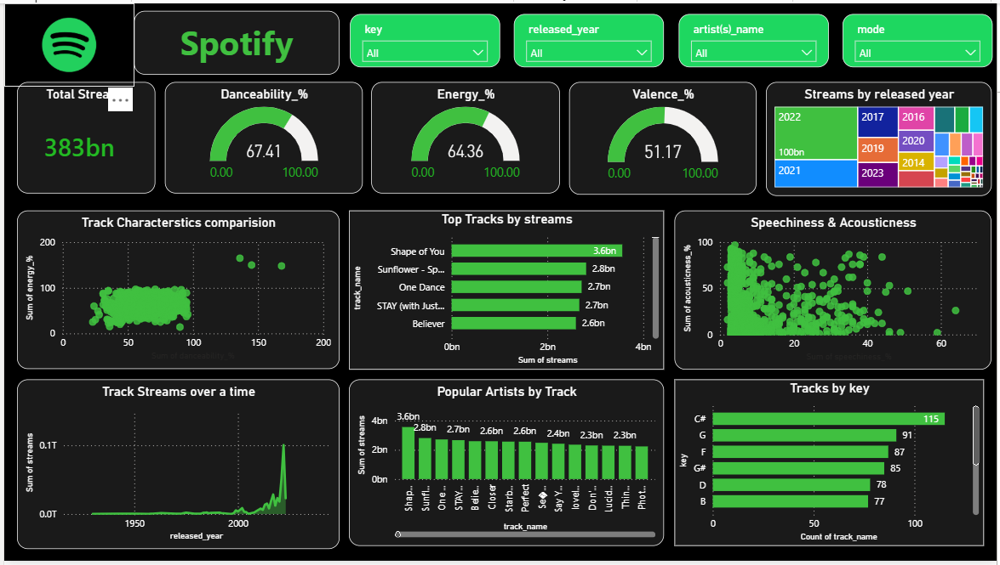

# spotify-analytics-dashboard
Built an interactive Spotify Analytics Dashboard using Power BI, Python, SQL, and Excel. Analyzed 383B+ streams, track performance, artist popularity, and audio features such as Danceability, Energy, Valence, and Acousticness. Developed dynamic visualizations and KPIs to uncover music trends and listener engagement insights.
# Spotify Music Analytics Dashboard

## Project Overview
This dashboard analyzes Spotify streaming data, artist performance, track characteristics, and music trends.

## Tools Used
- Power BI
- Python
- Pandas
- SQL
- Excel

## Features
- Track Performance Analysis
- Artist Popularity Analysis
- Audio Feature Analysis
- Streaming Trends
- Interactive Filters

## Dashboard Preview

## Key Insights
- Analyzed 383B+ streams
- Identified top artists and tracks
- Compared danceability, energy, valence, and acousticness metrics
